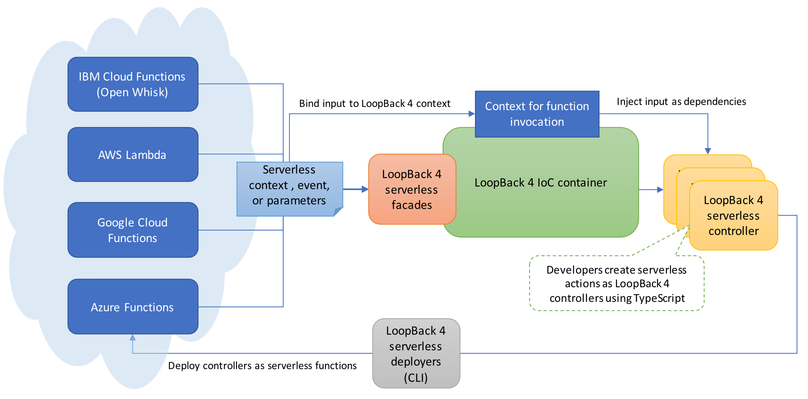

# loopback4-example-serverless

PoC to leverage TypeScript, LoopBack 4 Dependency Injection, and Webpack to create serverless functions/actions.



## Create a controller as serverless actions

```ts
import {inject} from '@loopback/context';
import {action} from '../decorators/action';

/**
 * A demo controller for serverless actions
 */
export class ServerlessController {
  /**
   * The controller can be optionally instantiated with dependency injections
   * by decorating the constructor parameters. Such values can be resolved from
   * the context for an invocation by the serverless container.
   */
  constructor() {}

  /**
   * An action without any parameters
   */
  // mark the method as an action or command
  // TBD: multiple actions per controller?
  @action()
  helloWorld() {
    return 'Hello, world!';
  }

  /**
   * An action takes an optional parameter named `name`
   * @param name User name
   */
  @action()
  hello(
    @inject('name', {optional: true})
    name: string,
  ) {
    return `Hello, ${name}!`;
  }

  /**
   * An async action takes an `id` to look up the user name
   * @param id
   */
  @action('greet')
  async helloAsync(@inject('id') id: number) {
    const userName = (await getUserNameById(id)) || 'world';
    return `Hello, ${userName}!`;
  }
}

/**
 * Mock up for user records and look up by id asynchronously
 */
const users: {[id: number]: string} = {
  1: 'John',
  2: 'Mary',
};

function getUserNameById(id: number): Promise<string | undefined> {
  return Promise.resolve(users[id]);
}
```

# Run the demo with IBM Cloud Functions

1. Build the module
```sh
npm run build
```

2. Deploy as a zip file
```sh
./bin/wsk-deploy.sh
```

Alternatively, we can deploy it as a webpack bundle:
```sh
./bin/wsk-create.sh
```

3. Invoke deployed actions
```sh
./bin/wsk-invoke.sh
```
